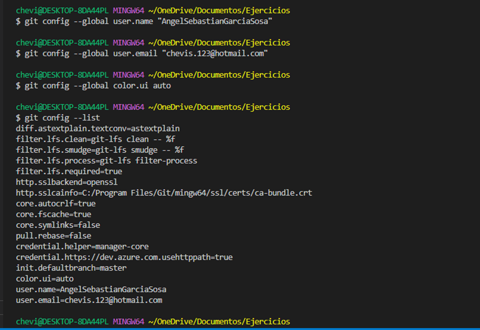
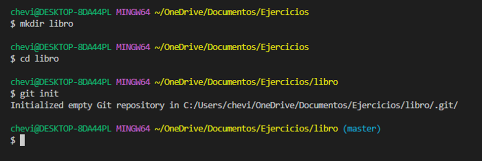
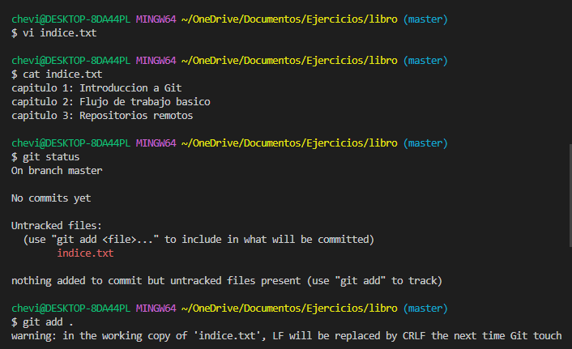
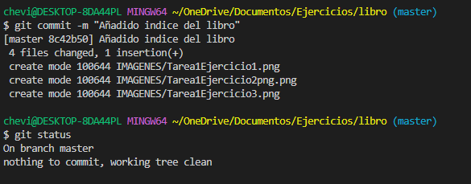
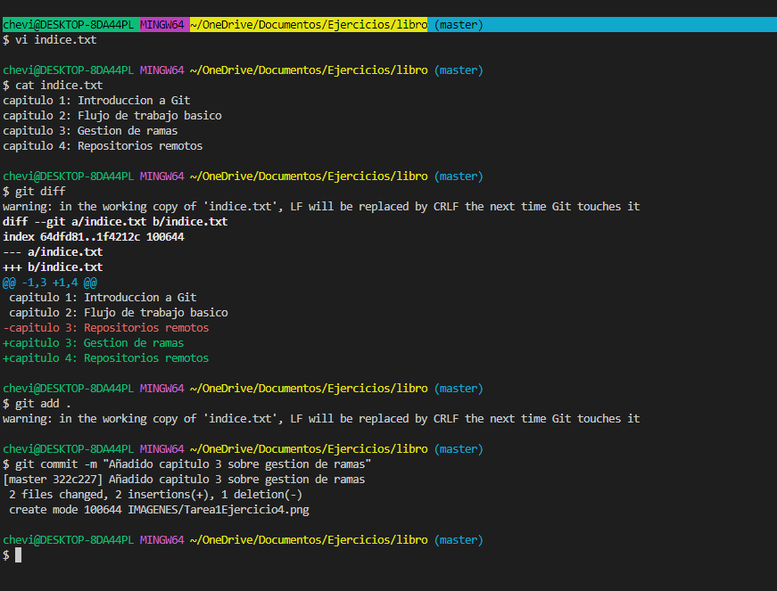
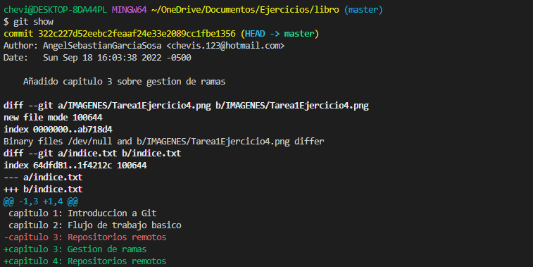
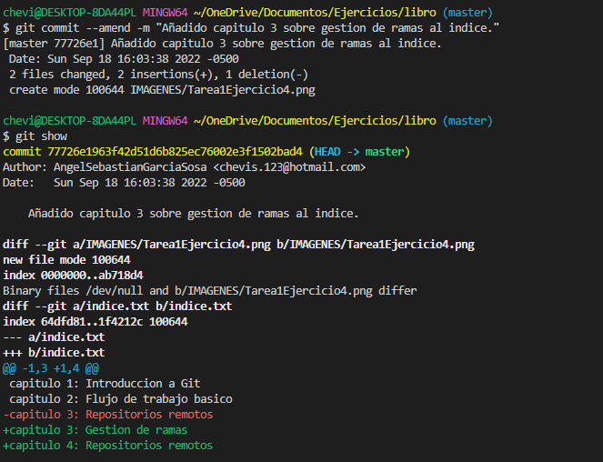

## Ejercicios de creacion y actualizacion de repositorios  
----------------
## Ejercicio 1  
Configurar Git definiendo el nombre del usuario, el correo electrónico y activar el coloreado de la salida. Mostrar la configuración final.

## Ejercicio 2  
Crear un repositorio nuevo con el nombre libro y mostrar su contenido.

## Ejercicio 3  

Comprobar el estado del repositorio.

1. Comprobar el estado del repositorio.

2. Crear un fichero indice.txt con el siguiente contenido:

Capítulo 1: Introducción a Git
Capítulo 2: Flujo de trabajo básico
Capítulo 3: Repositorios remotos

3. Añadir el fichero a la zona de intercambio temporal.

4. Volver a comprobar una vez más el estado del repositorio.

## Ejercicio 4  
Realizar un commit de los últimos cambios con el mensaje “Añadido índice del libro.” y ver el estado del repositorio.

## Ejercicio 5  
1. Cambiar el fichero indice.txt para que contenga lo siguiente:

Capítulo 1: Introducción a Git
Capítulo 2: Flujo de trabajo básico
Capítulo 3: Gestión de ramas
Capítulo 4: Repositorios remotos

Se realizan las modificaciones con este comando y se visualizan con el comando cat

Capítulo 1: Introducción a Git 
Capítulo 2: Flujo de trabajo básico
Capítulo 3: Gestión de ramas
Capítulo 4: Repositorios remotos
2. Mostrar los cambios con respecto a la última versión guardada en el repositorio.

3. Hacer un commit de los cambios con el mensaje “Añadido capítulo 3 sobre gestión de ramas”.

## Ejercicio 6  
1. Mostrar los cambios de la última versión del repositorio con respecto a la anterior.
2. Cambiar el mensaje del último commit por “Añadido capítulo 3 sobre gestión de ramas al índice.”
3. Volver a mostrar los últimos cambios del repositorio.

